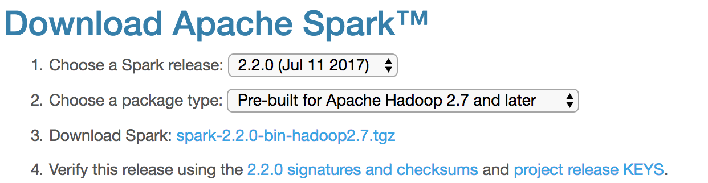

# Hybrid Collaborative Filtering Model with Apache Spark & ElasticSearch 
Please refer to report.pdf in this repository to get an understanding of recommendation engines and the model's implementation. 

# Steps
Follow these steps to create the required services and run the notebook locally.

1. [Clone the repo](#1-clone-the-repo)
2. [Set up Elasticsearch](#2-set-up-elasticsearch)
3. [Download the Elasticsearch Spark connector](#3-download-the-elasticsearch-spark-connector)
4. [Download Apache Spark](#4-download-apache-spark)
5. [Download the data](#5-download-the-data)
6. [Launch the notebook](#6-launch-the-notebook)
7. [Run the notebook](#7-run-the-notebook)

### 1. Clone the repo

Clone the `hybrid-elasticsearch-spark-recommender` repository locally. In a terminal, run the following command:

```
$ git clone https://github.com/shivraj95/hybrid-elasticsearch-spark-recommender.git
```

### 2. Set up Elasticsearch

This Code Pattern currently depends on Elasticsearch 5.3.0. Go to the [downloads page](https://www.elastic.co/downloads/past-releases/elasticsearch-5-3-0) and download the appropriate package for your system.

For example on Linux / Mac you can download the [TAR archive](https://artifacts.elastic.co/downloads/elasticsearch/elasticsearch-5.3.0.tar.gz) and unzip it using the commands:

```
$ wget https://artifacts.elastic.co/downloads/elasticsearch/elasticsearch-5.3.0.tar.gz
$ tar xfz elasticsearch-5.3.0.tar.gz
```

Change directory to the newly unzipped folder using:

```
$ cd elasticsearch-5.3.0
```

Next, you will need to install the [Elasticsearch vector scoring plugin](https://github.com/MLnick/elasticsearch-vector-scoring). You can do this by running the following command (Elasticsearch will download the plugin file for you):

```
$ ./bin/elasticsearch-plugin install https://github.com/MLnick/elasticsearch-vector-scoring/releases/download/v5.3.0/elasticsearch-vector-scoring-5.3.0.zip
```

Next, start Elasticsearch (do this in a separate terminal window in order to keep it up and running):

```
$ ./bin/elasticsearch
```

You should see some start up logs displayed. Check that the `elasticsearch-vector-scoring-plugin` is successfully loaded:

```
$ ./bin/elasticsearch
[2017-09-08T15:58:18,781][INFO ][o.e.n.Node               ] [] initializing ...
...
[2017-09-08T15:58:19,406][INFO ][o.e.p.PluginsService     ] [2Zs8kW3] loaded plugin [elasticsearch-vector-scoring]
[2017-09-08T15:58:20,676][INFO ][o.e.n.Node               ] initialized
...
```

Finally, you will need to install the Elasticsearch Python client. You can do this by running the following command (you should do this in a separate terminal window to the one running Elasticsearch):

```
$ pip install elasticsearch
```

### 3. Download the Elasticsearch Spark connector

The [Elasticsearch Hadoop project](https://www.elastic.co/products/hadoop) provides connectors between Elasticsearch and various Hadoop-compatible systems, including Spark. The project provides a ZIP file to download that contains all these connectors. You will need to run your PySpark notebook with the Spark-specific connector JAR file on the classpath. Follow these steps to set up the connector:

1. [Download](http://download.elastic.co/hadoop/elasticsearch-hadoop-5.3.0.zip) the `elasticsearch-hadoop-5.3.0.zip` file, which contains all the connectors. You can do this by running:
```
$ wget http://download.elastic.co/hadoop/elasticsearch-hadoop-5.3.0.zip
```
2. Unzip the file by running:
```
$ unzip elasticsearch-hadoop-5.3.0.zip
```
3. The JAR for the Spark connector is called `elasticsearch-spark-20_2.11-5.3.0.jar` and it will be located in the `dist` subfolder of the directory in which you unzipped the file above.

### 4. Download Apache Spark

This Code Pattern should work with any Spark 2.x version, however it is recommended that you download the latest version of Spark (currently 2.2.0) from the [downloads page](http://spark.apache.org/downloads.html). Once you have downloaded the file, unzip it by running:
```
$ tar xfz spark-2.2.0-bin-hadoop2.7.tgz
```

> *Note if you download a different version, adjust the relevant command used above and elsewhere in this Code Pattern accordingly*



You will also need to install [Numpy](http://www.numpy.org) in order to use Spark's machine learning library, [MLlib](http://spark.apache.org/mllib). If you don't have Numpy installed, run:
```
$ pip install numpy
```

### 5. Download the data

You will be using the [Movielens dataset](https://grouplens.org/datasets/movielens/) of ratings given by a set of users to movies, together with movie metadata. There are a few versions of the dataset. You should download the ["latest small" version](http://files.grouplens.org/datasets/movielens/ml-latest-small.zip).

Run the following commands from the base directory of the Code Pattern repository:

```
$ cd data
$ wget http://files.grouplens.org/datasets/movielens/ml-latest-small.zip
$ unzip ml-latest-small.zip
```

### 6. Launch the notebook

> The notebook should work with Python 2.7 or 3.x (and has been tested on 2.7.11 and 3.6.1)

To run the notebook you will need to launch a PySpark session within a Jupyter notebook. If you don't have Jupyter installed, you can install it by running the command:
```
$ pip install jupyter
```

Remember to include the Elasticsearch Spark connector JAR from [step 3](#3-download-the-elasticsearch-spark-connector) on the classpath when launching your notebook.

Run the following command to launch your PySpark notebook server locally. **For this command to work correctly, you will need to launch the notebook from the base directory of the Code Pattern repository that you cloned in [step 1](#1-clone-the-repo)**. If you are not in that directory, first `cd` into it.

```
PYSPARK_DRIVER_PYTHON="jupyter" PYSPARK_DRIVER_PYTHON_OPTS="notebook" ../spark-2.2.0-bin-hadoop2.7/bin/pyspark --driver-memory 4g --driver-class-path ../../elasticsearch-hadoop-5.3.0/dist/elasticsearch-spark-20_2.11-5.3.0.jar
```

This should open a browser window with the Code Pattern folder contents displayed. Click on the `notebooks` subfolder and then click on the `elasticsearch-spark-recommender.ipynb` file to launch the notebook.


> _Optional:_
>
> In order to display the images in the recommendation demo, you will need to access [The Movie Database API](https://www.themoviedb.org/documentation/api). Please follow the [instructions](https://developers.themoviedb.org/3/getting-started) to get an API key. You will also need to install the Python client using the command:
```
$ pip install tmdbsimple
```
>
> The demo will still work without this API access, but no images will be displayed (so it won't look as good!).

### 7. Run the notebook

When a notebook is executed, what is actually happening is that each code cell in
the notebook is executed, in order, from top to bottom.

Each code cell is selectable and is preceded by a tag in the left margin. The tag
format is `In [x]:`. Depending on the state of the notebook, the `x` can be:

* A blank, this indicates that the cell has never been executed.
* A number, this number represents the relative order this code step was executed.
* A `*`, this indicates that the cell is currently executing.

There are several ways to execute the code cells in your notebook:

* One cell at a time.
  * Select the cell, and then press the `Play` button in the toolbar. You can also hit `Shift+Enter` to execute the cell and move to the next cell.
* Batch mode, in sequential order.
  * From the `Cell` menu bar, there are several options available. For example, you
    can `Run All` cells in your notebook, or you can `Run All Below`, that will
    start executing from the first cell under the currently selected cell, and then
    continue executing all cells that follow.


# Troubleshooting

* Error: `java.lang.ClassNotFoundException: Failed to find data source: es.`

If you see this error when trying to write data from Spark to Elasticsearch in the notebook, it means that the Elasticsearch Spark connector (`elasticsearch-spark-20_2.11-5.3.0.jar`) was not found on the class path by Spark when launching the notebook.

  > Solution: First try the launch command from [step 6](#6-launch-the-notebook), **ensuring you run it from the base directory of the Code Pattern repo**.

  > If that does not work, try to use the fully-qualified path to the JAR file when launching the notebook, e.g.:
  > `PYSPARK_DRIVER_PYTHON="jupyter" PYSPARK_DRIVER_PYTHON_OPTS="notebook" ../spark-2.2.0-bin-hadoop2.7/bin/pyspark --driver-memory 4g --driver-class-path /FULL_PATH/elasticsearch-hadoop-5.3.0/dist/elasticsearch-spark-20_2.11-5.3.0.jar`
  > where `FULL_PATH` is the fully-qualified (not relative) path to the directory _from which you unzippd the `elasticsearch-hadoop` ZIP file_.

* Error: `org.elasticsearch.hadoop.EsHadoopIllegalStateException: SaveMode is set to ErrorIfExists and index demo/ratings exists and contains data. Consider changing the SaveMode`

If you see this error when trying to write data from Spark to Elasticsearch in the notebook, it means that you have already written data to the relevant index (for example the ratings data into the `ratings` index).

  > Solution: Try to continue working through the notebook from the next cell down. Alternatively, you can first delete all your indexes and re-run the Elasticsearch command to create index mappings (see the section *Step 2: Load data into Elasticsearch* in the notebook).

* Error: `ConnectionRefusedError: [Errno 61] Connection refused`

You may see this error when trying to connect to Elasticsearch in the notebook. This likely means your Elasticsearch instance is not running.

 > Solution: In a new terminal window, `cd` to the directory in which Elasticsearch is installed and run `./bin/elasticsearch` to start up Elasticsearch.

* Error: `Py4JJavaError: An error occurred while calling o130.save.
: org.elasticsearch.hadoop.rest.EsHadoopNoNodesLeftException: Connection error (check network and/or proxy settings)- all nodes failed; tried [[127.0.0.1:9200]]`

You may see this error when trying to read data from Elasticsearch into Spark (or writing data from Spark to Elasticsearch) in the notebook. This likely means your Elasticsearch instance is not running.

 > Solution: In a new terminal window, `cd` to the directory in which Elasticsearch is installed and run `./bin/elasticsearch` to start up Elasticsearch.

* Error: `ImportError: No module named elasticsearch`

If you encounter this error, it either means the Elasticsearch Python client is not installed, or cannot be found on the `PYTHONPATH`.

 > Solution: First try to install the client using `$ pip install elasticsearch` (if running in a Python virtual environment e.g. Conda or Virtualenv) or `$ sudo pip install elasticsearch` otherwise.
 > If that doesn't work, add your site-packages folder to your Python path (e.g. on Mac: `export PYTHONPATH=/Library/Python/2.7/site-packages` for Python 2.7). See this [Stackoverflow issue](https://stackoverflow.com/questions/7731947/add-module-to-pythonpath-nothing-works) for another example on Linux.
 > _Note:_ the same general solution applies to any other module import error that you may encounter.

 * Error: `HTTPError: 401 Client Error: Unauthorized for url: https://api.themoviedb.org/3/movie/1893?api_key=...`

If you see this error in your notebook while testing your TMDb API access, or generating recommendations, it means you have installed `tmdbsimple` Python package, but have not set up your API key.

> Solution: Follow the instructions at the end of [step 6](#6-launch-the-notebook) to set up your TMDb account and get your API key. Then copy the key into the `tmdb.API_KEY = 'YOUR_API_KEY'` line in the notebook cell at the end of _Step 1: Prepare the data_ (i.e. replacing `YOR_API_KEY` with the correct key). Once you have done that, execute that cell to test your access to TMDb API.


# License
[Apache 2.0](LICENSE)
